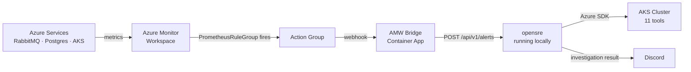

# opensre-azure

Azure integration layer for [opensre](https://github.com/opensre/opensre) — adds Azure Monitor Workspace (AMW) alert ingestion, AKS cluster inspection tools, and improved Discord formatting.

## Flow



## What's in here

This repo contains only the additions made to opensre for Azure/AKS support. The original opensre codebase is required as a base.

---

## Alert ingestion

### `POST /azure-alert?token=<BRIDGE_TOKEN>`
Accepts Azure Monitor common alert schema from an Action Group webhook. Translates to AlertManager v2 and queues an investigation.

### `POST /api/v1/alerts`
Accepts AlertManager v2 webhook format from in-cluster Alertmanager.

---

## AMW Bridge

FastAPI translator deployed as an Azure Container App.

**Source:** `bridge/main.py`

Receives → Azure common alert schema  
Translates → AlertManager v2  
Forwards → opensre `/api/v1/alerts`

**Env vars:**
```
OPENSRE_WEBHOOK_URL=https://<opensre-host>/api/v1/alerts
BRIDGE_TOKEN=<shared-secret>
```

---

## AKS Tools (11)

Auth via `DefaultAzureCredential` — works with `az login`, managed identity, or Service Principal. No kubeconfig needed.

**Env vars:**
```
AKS_SUBSCRIPTION_ID=
AKS_RESOURCE_GROUP=
AKS_CLUSTER_NAME=
AKS_NAMESPACE=
```

### Kubernetes API
| Tool | What it returns |
|---|---|
| `list_aks_pods` | Pod phase, restart count, container states |
| `list_aks_deployments` | Replica counts, availability |
| `get_aks_deployment_status` | Single deployment rollout detail |
| `list_aks_namespaces` | All namespaces |
| `get_aks_pod_logs` | Container logs (`tail_lines`, `previous`) |
| `get_aks_events` | Warning events — OOMKilled, BackOff, probe failures |
| `get_aks_node_health` | Node conditions, capacity, pressure flags |

### Azure Management Plane
| Tool | What it returns |
|---|---|
| `list_aks_clusters` | All clusters in subscription |
| `describe_aks_cluster` | k8s version, network plugin, addons |
| `list_aks_node_pools` | VM SKU, count, autoscaling, power state |
| `get_aks_node_pool_health` | Provisioning and power state per pool |

**New files:**
```
app/services/aks/          — Azure SDK client + management helpers
app/tools/AKS*Tool/        — 11 tool packages
app/tools/utils/aks_*      — param helpers + availability check
```

---

## Discord formatting

Investigations post structured embeds:

```
🚨  <alert name>
Namespace | Severity | Restarts    ← inline stats row
Root Cause
Key Findings (4 bullets max)
Next Steps (3 bullets, kubectl in code blocks)
```

Single post per investigation — no duplicates between slash command response and channel post.

---

## Starting locally

```bash
# starts opensre + cloudflared tunnel, patches Discord + Alertmanager + AMW bridge
/path/to/scripts/start.sh
```

See `AZURE.md` for full architecture and setup details.
