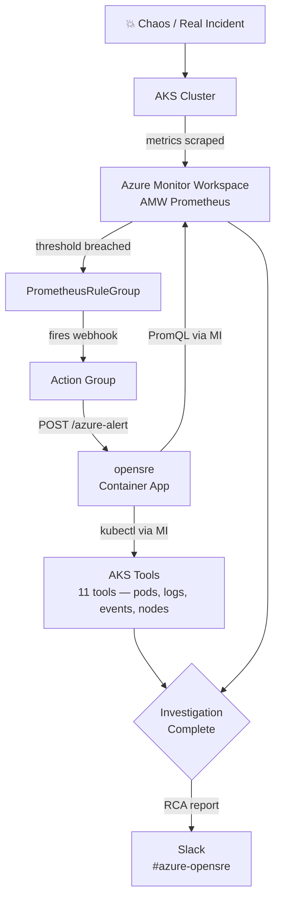

# opensre-azure

Azure layer for [opensre](https://github.com/opensre/opensre). Plugs AKS clusters into opensre so it can investigate alerts automatically and post findings to Slack.

## How it works



## What this repo adds

### Alert ingestion
Two endpoints on the opensre Container App that accept incoming alerts:

| Endpoint | Source |
|---|---|
| `POST /azure-alert?token=<BRIDGE_TOKEN>` | Azure Action Group (AMW PrometheusRuleGroup) |
| `POST /api/v1/alerts` | In-cluster Alertmanager (currently blocked by hub FW — use AMW path) |
| `POST /investigate` | Manual investigation — POST any alert payload to trigger RCA on demand |

### AKS tools (11)
opensre gets eyes inside your cluster. No kubeconfig needed — uses Managed Identity.

| Tool | What it sees |
|---|---|
| `list_aks_pods` | Pod phase, restart counts, container states |
| `list_aks_deployments` | Replica counts, availability |
| `get_aks_pod_logs` | Container logs |
| `get_aks_events` | OOMKilled, BackOff, probe failures |
| `get_aks_node_health` | Node pressure, capacity |
| `list_aks_namespaces` | All namespaces |
| `list_aks_clusters` | All clusters in subscription |
| `describe_aks_cluster` | k8s version, network, addons |
| `list_aks_node_pools` | VM SKU, count, autoscaling |
| `get_aks_node_pool_health` | Provisioning state per pool |
| `get_aks_deployment_status` | Single deployment rollout detail |

### AMW Prometheus tool
opensre can now pull metric time-series from Azure Monitor Workspace during an investigation. This is what lets it say "memory was climbing for 14 minutes before the OOMKill" instead of just "pod was killed."

Queries the AMW Prometheus HTTP API directly using Managed Identity — no Grafana needed.

```
AMW_PROMETHEUS_ENDPOINT=https://<your-amw>.prometheus.monitor.azure.com
```

Requires `Monitoring Data Reader` role on the AMW workspace for the Container App's MI. See `docs/amw-prometheus.mdx` for full setup steps.

### Slack delivery
Every investigation result posts to a Slack channel with sections for root cause, findings, inferred claims, and recommended actions with severity tags.

```
SLACK_WEBHOOK_URL=https://hooks.slack.com/services/...
```

## Deployment

opensre runs as an **Azure Container App** (not locally). It has unrestricted outbound internet so it can reach Anthropic's API and AMW Prometheus without VNet complications.

```bash
# Build and push image
az acr build --registry <your-acr> --image opensre:latest --file Dockerfile .

# Deploy new revision
az containerapp update \
  --name opensre \
  --resource-group <rg> \
  --image <your-acr>.azurecr.io/opensre:latest \
  --revision-suffix "v$(date +%Y%m%d%H%M%S)"
```

## Required env vars

```
ANTHROPIC_API_KEY=
SLACK_WEBHOOK_URL=
BRIDGE_TOKEN=

AKS_SUBSCRIPTION_ID=
AKS_RESOURCE_GROUP=
AKS_CLUSTER_NAME=
AKS_NAMESPACE=

AMW_PROMETHEUS_ENDPOINT=
```

## Chaos scenarios

12 pre-built scenarios in `chaos/` covering nginx, postgres, and rabbitmq. Run with:

```bash
YES=1 ./scripts/chaos-cycle.sh         # all 12
YES=1 ./scripts/chaos-cycle.sh c1      # single scenario
YES=1 ./scripts/chaos-cycle.sh extra:postgres-disk-fill  # disk fill demo
DRY_RUN=1 YES=1 ./scripts/chaos-cycle.sh  # dry run, no sleeps
```

## Docs

- `docs/amw-prometheus.mdx` — AMW Prometheus tool setup
- `docs/aks.mdx` — AKS tools setup
