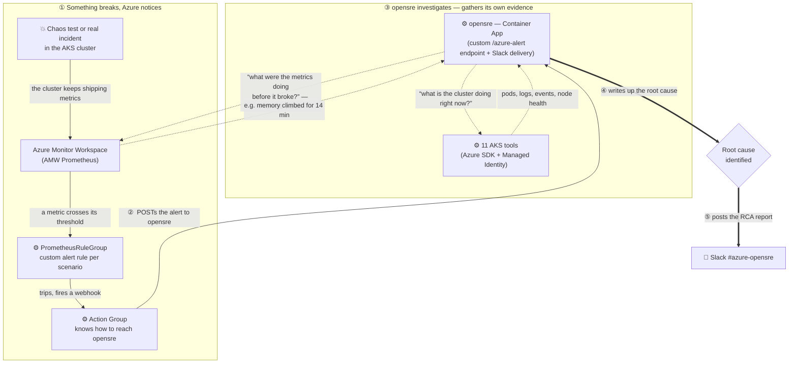

# opensre-azure

Azure layer on top of [Tracer-Cloud/opensre](https://github.com/Tracer-Cloud/opensre). Plugs AKS clusters into opensre so it can investigate alerts automatically and post findings to Slack.

## What we built (vs upstream Tracer-Cloud/opensre)

Everything below is custom to this repo — it does not exist in upstream opensre:

| Component | Where | What it does |
|---|---|---|
| **11 AKS tools** | `app/tools/AKS*` | Let opensre look inside the Kubernetes cluster on its own — no kubeconfig handed to it. It signs in to Azure as itself (Managed Identity) and answers the questions an engineer would ask while debugging: *which pods are crashing, what do their logs say, what events fired, are the nodes healthy* (workload side), plus *what clusters and node pools exist and how are they set up* (management side). |
| **AMW Prometheus query tool** | `app/tools/AMWPrometheusQueryTool` | Lets opensre look at **metric history**, not just the current snapshot — e.g. *"was memory climbing for 14 minutes before the pod died?"* It queries Azure Monitor Workspace's Prometheus directly (again signing in via Managed Identity). This is the difference between reporting "the pod was killed" and "the pod was killed because memory had been rising steadily." |
| **`/azure-alert` ingestion** | `app/remote/server.py` | The front door that lets Azure wake opensre up. When an Azure alert fires, Azure POSTs a webhook in its own "common alert schema" — a format opensre doesn't natively understand. This endpoint receives that webhook (guarded by a shared-secret token), translates it into the AlertManager format opensre already speaks, and kicks off an investigation in the background. Without it, an Azure alert would have no way to reach opensre. |
| **Slack delivery** | `app/remote/server.py`, `app/delivery/.../report.py` | When an investigation finishes, this posts the result to a Slack channel as a readable report — root cause, validated findings, inferred claims, and recommended actions tagged by severity — so a human sees the answer without digging through logs. Replaces opensre's original Discord delivery. |

> **Not ours.** `AzureMonitorLogsTool` and the `AzureSQL*` tools ship with upstream Tracer-Cloud/opensre — they are not part of this Azure layer.

## How it works


```mermaid
flowchart TD
    F["⚙️ opensre — Container App<br/>(custom /azure-alert endpoint + Slack delivery)"]

    subgraph detect["① Something breaks, Azure notices"]
        A["💥 Chaos test or real incident<br/>in the AKS cluster"]
        C["Azure Monitor Workspace<br/>(AMW Prometheus)"]
        D["⚙️ PrometheusRuleGroup<br/>custom alert rule per scenario"]
        E["⚙️ Action Group<br/>knows how to reach opensre"]
        A -->|"the cluster keeps shipping metrics"| C
        C -->|"a metric crosses its threshold"| D
        D -->|"trips, fires a webhook"| E
    end

    E -->|"②  POSTs the alert to opensre"| F

    subgraph investigate["③ opensre investigates — gathers its own evidence"]
        G["⚙️ 11 AKS tools<br/>(Azure SDK + Managed Identity)"]
        F -.->|"“what is the cluster doing right now?”"| G
        G -.->|"pods, logs, events, node health"| F
        F -.->|"“what were the metrics doing<br/>before it broke?” — PromQL via MI"| C
        C -.->|"e.g. memory climbed for 14 min"| F
    end

    F ==>|"④ writes up the root cause"| H{"Root cause<br/>identified"}
    H ==>|"⑤ posts the RCA report"| I["💬 Slack #azure-opensre"]
```

> ⚙️ = custom-built for this setup

## What this repo adds

### Alert ingestion
Two endpoints on the opensre Container App that accept incoming alerts:

| Endpoint | Source |
|---|---|
| `POST /azure-alert?token=<BRIDGE_TOKEN>` | Azure Action Group (AMW PrometheusRuleGroup) |
| `POST /api/v1/alerts` | In-cluster Alertmanager (currently blocked by hub FW — use AMW path) |
| `POST /investigate` | Manual investigation — POST any alert payload to trigger RCA on demand |

### AKS tools (11)
opensre gets eyes inside your cluster. No kubeconfig needed — uses Managed Identity.

| Tool | What it sees |
|---|---|
| `list_aks_pods` | Pod phase, restart counts, container states |
| `list_aks_deployments` | Replica counts, availability |
| `get_aks_pod_logs` | Container logs |
| `get_aks_events` | OOMKilled, BackOff, probe failures |
| `get_aks_node_health` | Node pressure, capacity |
| `list_aks_namespaces` | All namespaces |
| `list_aks_clusters` | All clusters in subscription |
| `describe_aks_cluster` | k8s version, network, addons |
| `list_aks_node_pools` | VM SKU, count, autoscaling |
| `get_aks_node_pool_health` | Provisioning state per pool |
| `get_aks_deployment_status` | Single deployment rollout detail |

### AMW Prometheus tool
opensre can now pull metric time-series from Azure Monitor Workspace during an investigation. This is what lets it say "memory was climbing for 14 minutes before the OOMKill" instead of just "pod was killed."

Queries the AMW Prometheus HTTP API directly using Managed Identity — no Grafana needed.

```
AMW_PROMETHEUS_ENDPOINT=https://<your-amw>.prometheus.monitor.azure.com
```

Requires `Monitoring Data Reader` role on the AMW workspace for the Container App's MI. See `docs/amw-prometheus.mdx` for full setup steps.

### Slack delivery
Every investigation result posts to a Slack channel with sections for root cause, findings, inferred claims, and recommended actions with severity tags.

```
SLACK_WEBHOOK_URL=https://hooks.slack.com/services/...
```

## Deployment

opensre runs as an **Azure Container App** (not locally). It has unrestricted outbound internet so it can reach Anthropic's API and AMW Prometheus without VNet complications.

```bash
# Build and push image
az acr build --registry <your-acr> --image opensre:latest --file Dockerfile .

# Deploy new revision
az containerapp update \
  --name opensre \
  --resource-group <rg> \
  --image <your-acr>.azurecr.io/opensre:latest \
  --revision-suffix "v$(date +%Y%m%d%H%M%S)"
```

## Required env vars

```
ANTHROPIC_API_KEY=
SLACK_WEBHOOK_URL=
BRIDGE_TOKEN=

AKS_SUBSCRIPTION_ID=
AKS_RESOURCE_GROUP=
AKS_CLUSTER_NAME=
AKS_NAMESPACE=

AMW_PROMETHEUS_ENDPOINT=
```

## Chaos scenarios

12 pre-built scenarios in `chaos/` covering nginx, postgres, and rabbitmq. Run with:

```bash
YES=1 ./scripts/chaos-cycle.sh         # all 12
YES=1 ./scripts/chaos-cycle.sh c1      # single scenario
YES=1 ./scripts/chaos-cycle.sh extra:postgres-disk-fill  # disk fill demo
DRY_RUN=1 YES=1 ./scripts/chaos-cycle.sh  # dry run, no sleeps
```

## Docs

- `docs/amw-prometheus.mdx` — AMW Prometheus tool setup
- `docs/aks.mdx` — AKS tools setup
